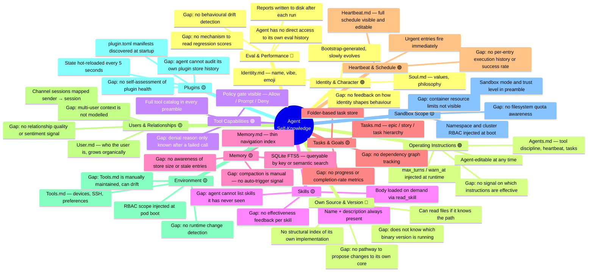

# Agent Self-Knowledge Map

A contributor reference showing how well the agent understands each aspect of itself, and where the gaps are. Use this to find high-leverage areas for improvement.

**Strength scale:** 🟢 Strong — 🟡 Partial — 🔴 Weak / missing

---

---

## Breakdown by area

| Area | Strength | What the agent knows | Key gaps |
|---|---|---|---|
| **Identity & Character** | 🟢 | Deep values and philosophy (`Soul.md`), shallow name and vibe (`Identity.md`) | No introspective feedback on how identity shapes actual behaviour |
| **Operating Instructions** | 🟢 | Full operating manual in `Agents.md`, injected every session; agent can edit it | No signal on which instructions are followed vs. ignored |
| **Tool Capabilities** | 🟢 | Full tool catalog with policy state in every preamble | Denial reason only surfaces after a failed call |
| **Skills** | 🟡 | Name + description always visible; body loaded on demand | Cannot enumerate undiscovered skills; no skill effectiveness data |
| **Memory** | 🟡 | Thin navigation index (`Memory.md`) + FTS5 queryable store | No store-size or staleness awareness; compaction is manually triggered |
| **Tasks & Goals** | 🟡 | Epic/story/task hierarchy in `Tasks.md` and `tasks/` folder | No dependency graph; no completion rate metrics |
| **Heartbeat & Schedule** | 🟢 | Full schedule visible and editable; urgent entries fire immediately | No per-entry execution history or success/failure rate |
| **Users & Relationships** | 🟡 | `User.md` grows organically; channel sessions map sender to session | No sentiment or relationship quality signal; multi-user context not modelled |
| **Environment** | 🟡 | `Tools.md` cheat sheet; RBAC scope injected at boot | `Tools.md` is manually maintained and can drift; no runtime change detection |
| **Plugins** | 🟡 | Manifests discovered; state hot-reloaded every 5 seconds | No plugin health self-assessment; no audit trail of plugin store changes |
| **Sandbox Scope** | 🟡 | Namespace/cluster RBAC in preamble; sandbox trust level visible | Container CPU/memory limits not visible; no filesystem quota awareness |
| **Eval & Performance** | 🔴 | Reports written to disk | Agent has no access to its own eval history or regression scores |
| **Own Source & Version** | 🔴 | Can read source files by path if it knows them | No version awareness; no structural index of its own implementation |

---

## Where contributors can have the most impact

Areas marked 🔴 represent places where the agent is essentially blind about itself — high leverage for contributors working on the self-management vision.

**Eval & Performance access** — give the agent a way to read its own past eval reports and notice when its scores on a rubric have changed. Even a simple `mem_add` step at the end of each eval run would help.

**Version awareness** — expose the running binary version and build metadata into the preamble so the agent always knows what it is running on.

**Memory health signals** — surface store size, oldest entry age, and compaction recency so the agent can self-trigger compaction before context pressure builds.

**Plugin audit trail** — persist a log of plugin installs, upgrades, and removals that the agent can query; this is the foundation for the agent reasoning about its own capability history.

**Skill effectiveness** — after an agent run that used a skill, record whether the outcome was good; over time the agent can weight its skill catalog by usefulness.
